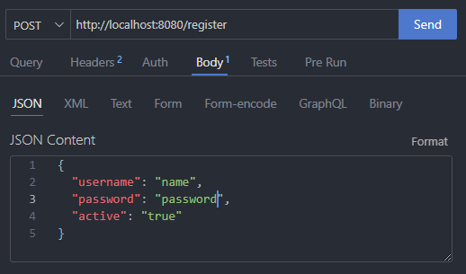
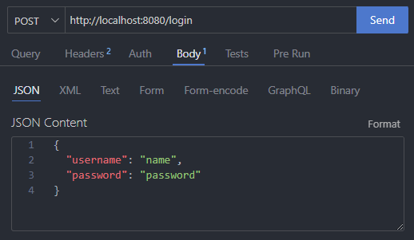
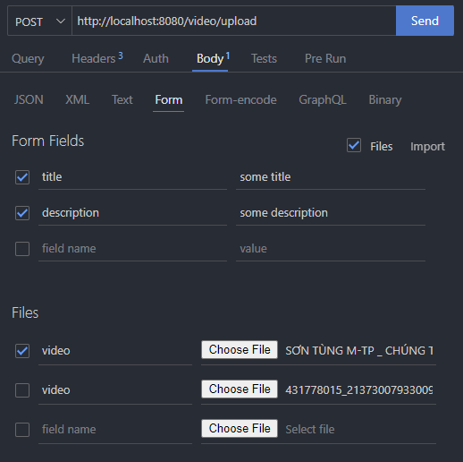
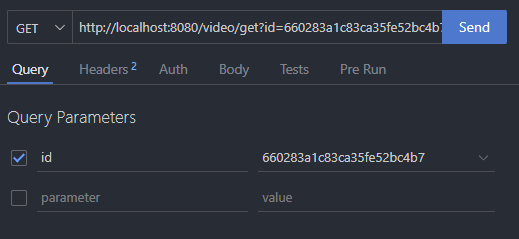

# Streaming-Backend

## Installation

1. Create database named "streaming" in MongoDB
2.

## API

The backend of this streaming project exposes the following API endpoints:

1. `http://localhost:8080/register` 

2. `http://localhost:8080/login` 

3. `http://localhost:8080/video/upload`

4. `http://localhost:8080/video/get/{id}`

